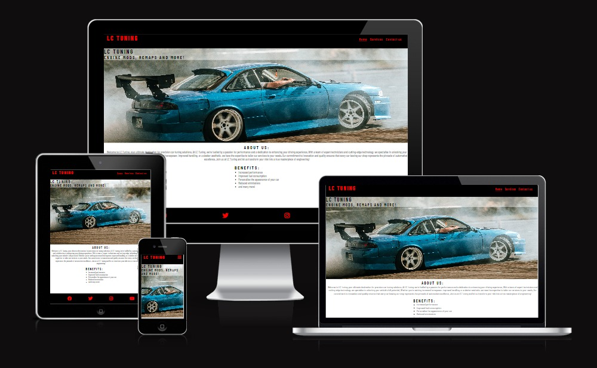
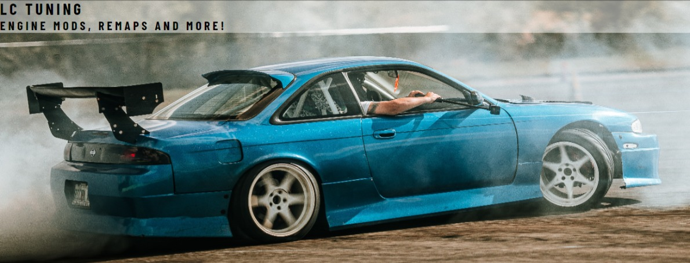
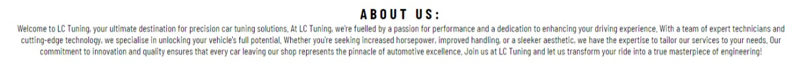
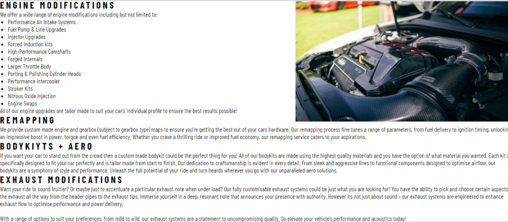
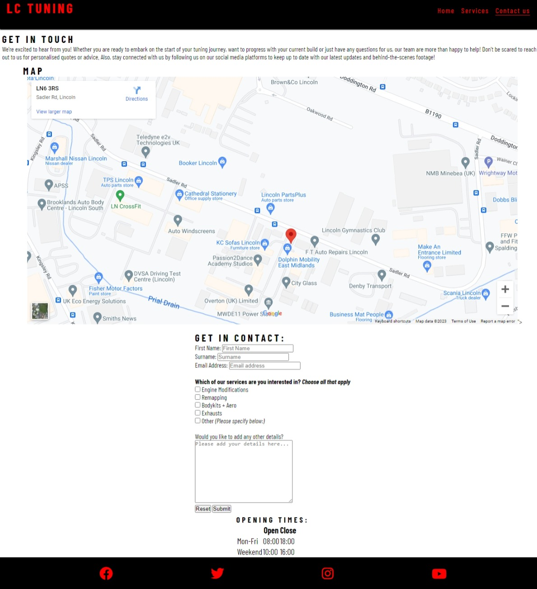
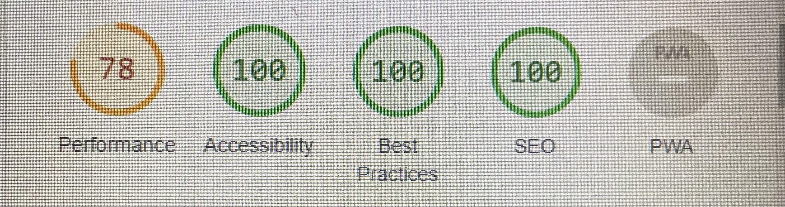

# LC Tuning

LC Tuning is a website targeted at car enthusiasts who want to make the most out of their car's performance, styling and efficiency.

The website contains 3 seperate pages in which the users will be able to see the services the company provides, the benefits of those services and a contact form to get in touch with their queriss or to get a quote.

## Features

### Header/Navigation

- In the top left of the header we see the LC Tuning logo which acts as a link to the homepage.
- We also see a navigation section in the top right of the header which leads to each of the 3 pages of the website with the currently active page being underlined
- This section clearly shows to the user the name of the company and makes all of the pages on the website easy to find.
- The header section is styled using the companies main 2 colours (black and red) and will prove to be a common occurence throughout the website so the user knows what to expect.
- The header's position is fixed to the top of the screen so that the user is always able to use the navigation links regardless of how far down they scroll. This promotes the sites ease of use.

### Background Image

- The site contains a background image which gives the user a feel for what the website is about and ties in nicely with the services that we offer.
- It has some brief text overlayed on top which gives the user a very brief description of what we do and what they can expect on our page.
- The text colour used contrasts nicely with the overlay and the image to show clearly each section.

### About Us

The about us section gives a more detailed introduction to the website and a sneek peek into the services we provide. It entices the user to read more and continue to explore the
page.

### Benefits

The benefits section is formatted as a simplistic bullet point list containing the benefits of our services. There is minimal distractions in this page so the user can fully concentrate on the content they are viewing.

### Footer
- The footer has the same styling cues as the header to provide familiarity to the user and ease them into exploration of the site.
- It contains links to the companies social media sites so anyone who is interested in our products can explore some of our other content.
- Each social media link is clickable via the associated icon to make navigation as easy as possible.

### Services

The services page is there to showcase the products we offer and what they can do for your vehicle. This is the main 'meat' of the website and gives the reader a detailed look at what they can expect from us should they choose us for their modifications.

### Contact Us

- This section contains one final push of promotion to entice the user into filling out the beloow form.
- There is a map which displays the location of our business to inform our potential customers who may wish to come in and have a look at the work we do.
- The contact form collects the users first + last name, email address and some checkboxes of what services they are interested in. It also contains a details box where they can write to us to include further details about their enquiry and to ask any questions they may have.
- There is an opening times section which gives the user the information they may need should they wish to contact us.
- This section has been formatted in the same way as the benefits section from the main page whereby the content has been centralised and isolated to minimise the distractions and further provide a sense of similarity from the main page.

## Testing

- I have tested that the website looks good and functions correctly on the main browsers: Microsoft Edge, Google Chrome, Mozilla Firefox and Safari.
- I ensured the project was responsive to different screen sizes using developer tools along with the common break points.
- I confirmed that all of the text was contrasted correctly with the background colours and images to ensure each section was legible to all users.
- I have tested the form section to make sure that all fields are required, the correct data is put in each field (e.g only email addresses allowed in the email field) and that the reset and submit buttons all work as intended.

## Validator Testing

- I used W3C HTML validator to ensure that all of my HTML code was error free
- I used W3C CSS validator to ensure that all of my CSS code was error free
- I used lighthouse in developer tools to analyse performance (pictured below)

## Deployment

The LC Tuning website was deployed on GitHub pages using the folllowing steps:

1. Navigate to the settings tab of the GitHub repository
2. Select the Master Branch from the source section drop down menu
3. The link to the live website is then provided

The link to the live deployment can be found [here:](https://liam-clark-99.github.io/lc-tuning/index.html)

## Credits

This project was heavily influenced by the Code Institute's Love Running project and all of the supporting documents on the Code Institute's learning material.